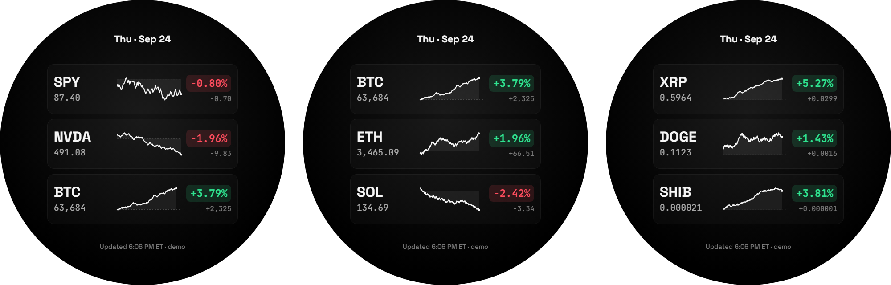
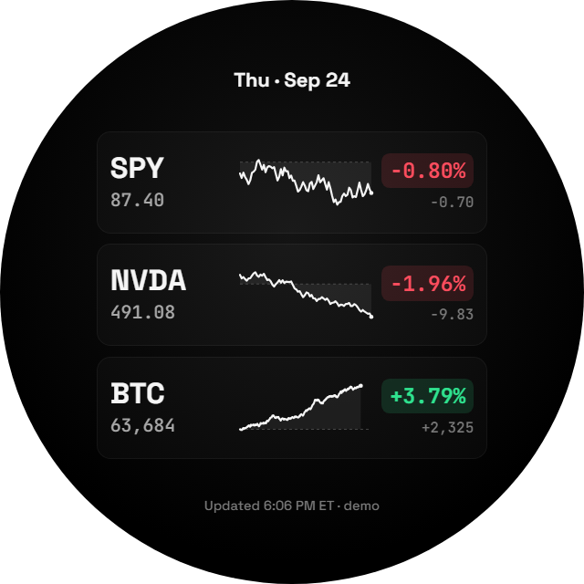
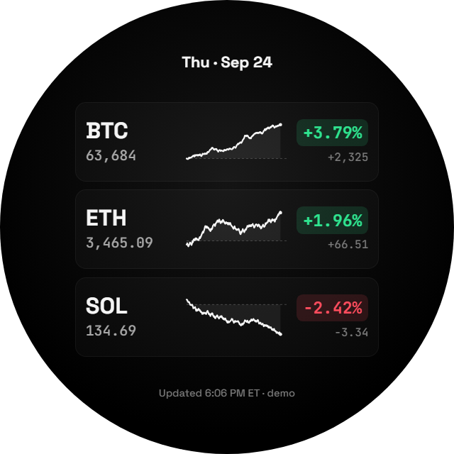
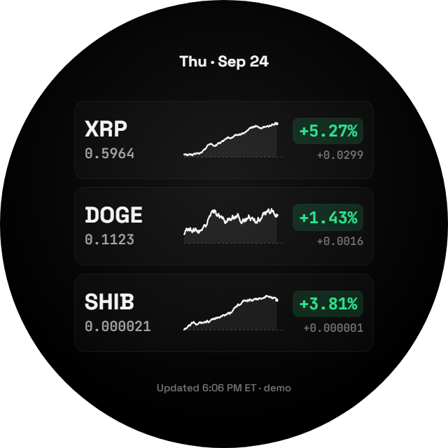
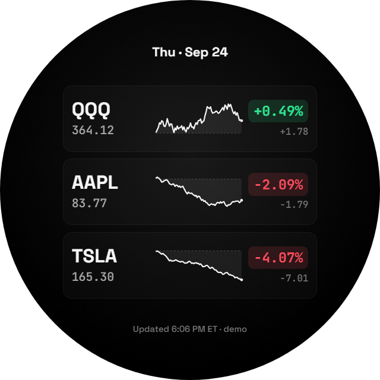
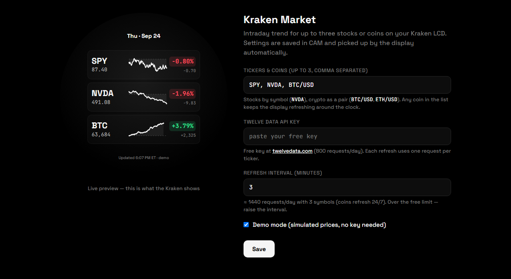
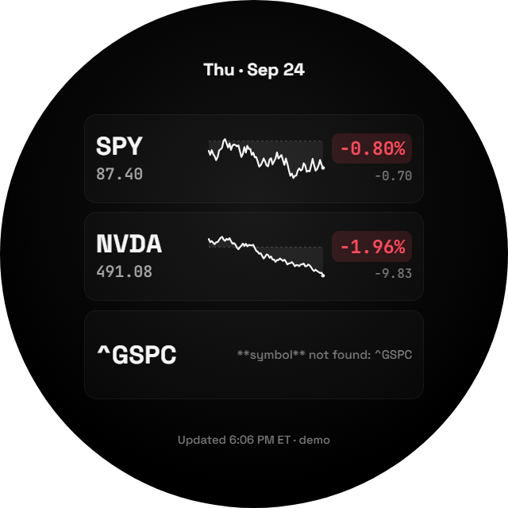

# Kraken Market

Intraday stock and crypto trend for the circular LCD on an NZXT Kraken cooler. One HTML file, no build step, no dependencies.



<sub>Screenshots are demo mode — prices are a seeded random walk, not live quotes. Everything else (colours, precision, sparkline length) renders exactly as it does with a real API key.</sub>

---

## What it does

- **Up to three symbols**, stocks and crypto side by side.
- **Intraday sparkline** per symbol against a dashed previous-close baseline, so the shape of the day reads at a glance.
- **Percent badge in green or red**, neutral white when the move is under 0.005%.
- **24/7 aware.** Coins keep refreshing overnight and on weekends; an all-stock list falls back to a 30-minute cadence once the US session closes.
- **Demo mode** for setup and screenshots — no API key needed.
- **Fits the circle.** Every dimension is derived from one unit equal to 1% of the display diameter, so it scales to whatever panel it lands on.

## The panel

<table>
<tr>
<td width="50%"><br><sub><b>Stocks and a coin.</b> BTC's line stops short of the right edge because its day is still running.</sub></td>
<td width="50%"><br><sub><b>Coins only.</b> Nothing on screen refers to a market session.</sub></td>
</tr>
<tr>
<td width="50%"><br><sub><b>Sub-dollar coins.</b> Precision follows magnitude — four decimals for XRP, six for SHIB.</sub></td>
<td width="50%"><br><sub><b>Stocks only.</b> The classic case, unchanged.</sub></td>
</tr>
</table>

## Setup

### 1. Host the file

The page is a single `index.html`. Serve it anywhere CAM can reach over HTTPS — GitHub Pages works well: enable Pages on the `main` branch in **Settings → Pages**, and the page lands at `https://<user>.github.io/kraken-market/`.

### 2. Point CAM at it

In NZXT CAM, set the Kraken's LCD to **Web Integration** and give it the page URL with the display flag:

```
https://<user>.github.io/kraken-market/?kraken=1
```

The `?kraken=1` flag strips the settings form and renders the bare circle, centred and sized to the panel.

### 3. Configure it

Open the **same URL without the flag** to get the settings form, with a live preview of exactly what the Kraken will show:



Settings are saved to `localStorage` under `kraken-market-v1`. Because both views share an origin, saving in the config view pushes straight to the display view through a `storage` event — no reload needed.

## Symbols

| Asset | How to enter it | Example |
| --- | --- | --- |
| Stock or ETF | Plain symbol | `NVDA`, `SPY`, `QQQ` |
| Crypto | Pair, with the quote currency | `BTC/USD`, `ETH/USD` |

`/USD` is dropped from the label, so `BTC/USD` shows as **BTC**. Other quote currencies are left intact — `BTC/EUR` stays `BTC/EUR`.

**Bare coin tickers are not auto-mapped**, deliberately: `SOL` and `ADA` are also real NYSE tickers, so guessing would silently show you the wrong asset. Write the pair.

### Indices aren't available

`^GSPC`, `SPX`, `^IXIC` and friends will not resolve. The caret is Yahoo Finance syntax, and Twelve Data's index catalogue carries no US entries at all — a symbol search for `GSPC` returns Goldman Sachs preferred stock. Use the tracking ETF instead: **SPY** or **VOO** for the S&P 500, **DIA** for the Dow, **QQQ** for the Nasdaq-100.

A symbol that can't be resolved degrades to a single row carrying the API's own message. The other rows keep working:



## API usage

Data comes from [Twelve Data](https://twelvedata.com/pricing). The free tier allows **800 requests/day**, and each symbol in a refresh costs one — three symbols on a three-minute interval is three requests every three minutes.

The settings form shows a running estimate, but the shape of it is:

| Symbols | Interval | Stocks only | With any coin |
| --- | --- | --- | --- |
| 3 | 3 min | 495 | 1,440 ⚠️ |
| 3 | 5 min | 339 | 864 ⚠️ |
| 3 | 6 min | 300 | **720** |
| 3 | 10 min | 222 | 432 |
| 1 | 3 min | 165 | 480 |

Adding a coin removes the overnight discount — a 24/7 symbol is refreshed around the clock, so the whole list is. **Six minutes is the sweet spot for three symbols with crypto**; anything faster crosses the free limit.

## How it works

Everything lives in `index.html` — 395 lines, about 260 of them vanilla JS. No framework, no bundler.

- **Market clock.** A self-contained NYSE calendar computes holidays (including Good Friday via the Gregorian Easter algorithm) and half-days, so the app knows when the US session is actually open without calling anything.
- **Bars.** Data is 5-minute candles. A stock day is 78 of them, a crypto day is 288; each quote carries its own count, and its sparkline is scaled to it. That's why a coin's line is shorter mid-day — it's a genuine fraction of a longer session, not a rendering artefact.
- **Previous close.** Taken from the last bar of the prior date in the series, which is what the dashed baseline draws and what the percentage is measured against.
- **Sizing.** A `ResizeObserver` sets `--u` to 1% of the display's width; every font size, padding and radius is a multiple of it.

## Limits

- Three symbols. A fourth row won't fit the circle legibly.
- Intraday only — no multi-day or historical view.
- US market hours are hardcoded to NYSE. Non-US equities will render, but the open/closed cadence will be wrong for them.
- The API key sits in `localStorage` in plain text. It's a free read-only market-data key, but don't reuse a key that has anything else attached to it.
